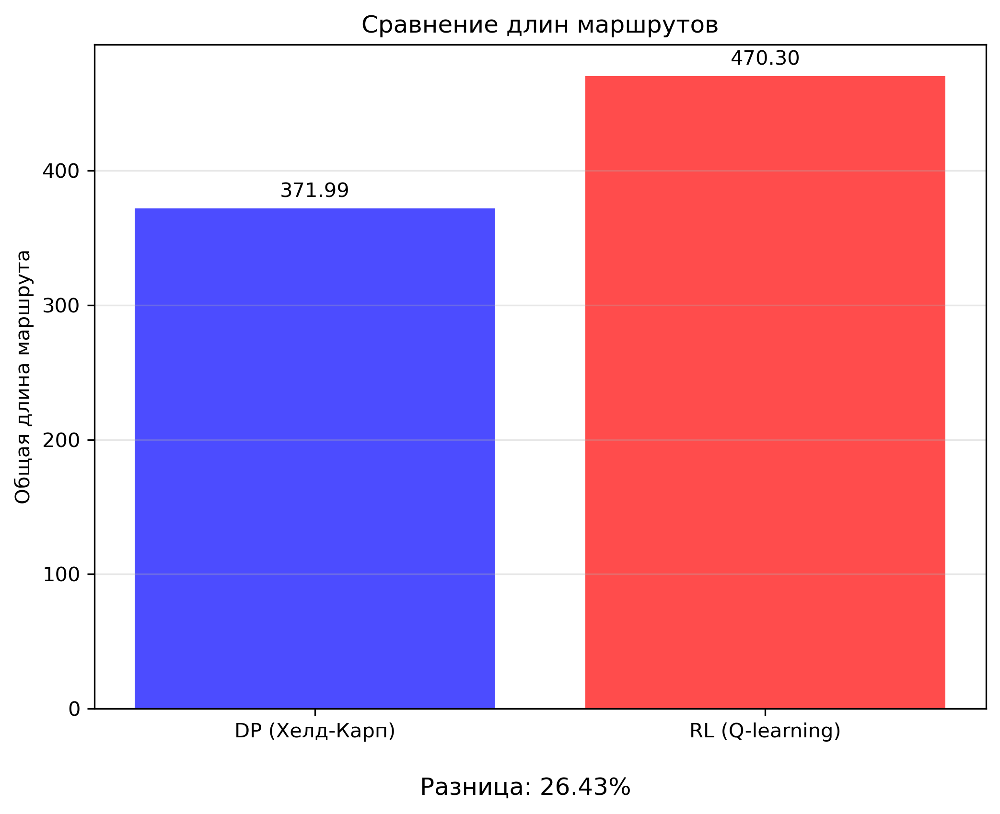

# Решение задачи коммивояжера (TSP) с использованием различных алгоритмов

## Содержание
1. [Введение](#введение)
2. [Структура проекта](#структура-проекта)
3. [Быстрый старт](#быстрый-старт)
4. [Теоретические основы](#теоретические-основы)
   - [Алгоритм Хелда-Карпа](#алгоритм-хелда-карпа)
   - [Обучение с подкреплением (Double Q-learning)](#обучение-с-подкреплением-double-q-learning)
5. [Установка и зависимости](#установка-и-зависимости)
6. [Использование](#использование)
   - [Подготовка данных](#подготовка-данных)
   - [Метод динамического программирования](#метод-динамического-программирования)
   - [Метод обучения с подкреплением](#метод-обучения-с-подкреплением)
   - [Прогнозирование маршрута](#прогнозирование-маршрута)
   - [Анализ и верификация результатов](#анализ-и-верификация-результатов)
7. [Результаты анализа](#результаты-анализа)
8. [Сравнение производительности](#сравнение-производительности)
9. [Заключение и возможности для улучшения](#заключение-и-возможности-для-улучшения)
10. [Веб-платформа](#веб-платформа)

## Введение

Задача коммивояжера (Traveling Salesman Problem, TSP) — одна из самых известных задач комбинаторной оптимизации. Суть задачи заключается в поиске самого короткого маршрута, который проходит через все заданные города и возвращается в исходную точку, посещая каждый город ровно один раз.

Задача имеет множество практических применений в логистике, планировании маршрутов, проектировании микросхем и многих других областях. Несмотря на кажущуюся простоту формулировки, задача коммивояжера относится к классу NP-трудных задач, что делает поиск точного решения для больших экземпляров вычислительно сложной задачей.

В данном проекте реализованы два принципиально разных подхода к решению задачи коммивояжера:
1. **Метод динамического программирования** (алгоритм Хелда-Карпа) — точный алгоритм со сложностью O(n²·2ⁿ)
2. **Метод обучения с подкреплением** (Double Q-learning) — эвристический подход, основанный на машинном обучении

## Быстрый старт

Для быстрого запуска проекта выполните следующие шаги:

### 1. Клонирование репозитория и настройка среды

```bash
# Клонирование репозитория
git clone https://github.com/your-username/TSP_RL_agent.git
cd TSP_RL_agent

# Создание виртуальной среды и установка зависимостей для Python
python -m venv .venv
source .venv/bin/activate  # для Linux/Mac
# или
.venv\Scripts\activate     # для Windows

# Установка зависимостей Python
pip install -r requirements.txt
```

### 2. Запуск API-серверов

```bash
# Запуск обоих API-серверов одновременно
python Application_part/server_starter.py
```

Серверы будут доступны по следующим адресам:
- DP API (алгоритм Хелда-Карпа): http://localhost:8000
- RL API (алгоритм Double Q-learning): http://localhost:8001

### 3. Запуск веб-интерфейса

```bash
# Переход в директорию веб-платформы
cd WebPlatform

# Установка зависимостей
npm install

# Запуск в режиме разработки
npm run dev
```

Веб-интерфейс будет доступен по адресу: http://localhost:5173

### 4. Работа с веб-интерфейсом

1. **Добавление точек**:
   - Кликните на карте, чтобы добавить точки
   - Или загрузите CSV-файлы с координатами и матрицей расстояний

2. **Выбор алгоритма**:
   - 2GIS API (для небольшого количества точек, до 10)
   - Held-Karp (для оптимального решения, до 20 точек)
   - Q-learning (для больших задач)

3. **Построение маршрута**:
   - Нажмите "SEND" для расчета маршрута
   - Результат отобразится на карте и в таблице маршрутов

### 5. Генерация тестовых данных (опционально)

Для создания тестовых наборов данных:

```bash
# Для компонента DP
python DP_part/environment/generate_env.py --num_cities 10 --save_path DP_part/tests/test_new

# Для компонента RL
python RL_part/rl_environment/generate_env.py --num_cities 15 --save_path RL_part/tests/test_new
```

## Структура проекта

Проект организован следующим образом:

```
TSP_RL_agent/
│
├── DP_part/
│   ├── held_karp.py         # Реализация алгоритма Хелда-Карпа
│   ├── dp_api.py            # API для алгоритма Хелда-Карпа
│   └── tests/               # Тестовые данные для DP
│       └── */               # Поддиректории с тестами
│           ├── cities.csv
│           ├── distances.csv
│           └── best_route.txt
│
├── RL_part/
│   ├── double_q_learning.py # Обучение модели с использованием Double Q-learning
│   ├── predict_route.py     # Прогнозирование маршрута с использованием обученной модели
│   ├── rl_api.py            # API для алгоритма Q-learning
│   └── tests/               # Директория с тестовыми данными
│       └── */               # Поддиректории с различными тестами
│           ├── cities.csv        # Координаты городов
│           ├── distances.csv     # Матрица расстояний между городами
│           ├── q1_weights.txt    # Веса первой Q-таблицы (после обучения)
│           ├── q2_weights.txt    # Веса второй Q-таблицы (после обучения)
│           ├── best_route.txt    # Лучший маршрут, найденный при обучении
│           └── predicted_route.txt  # Прогнозируемый маршрут
│
├── Application_part/
│   ├── server_starter.py    # Скрипт для запуска API-серверов
│   ├── test_api.py          # Скрипт для тестирования API
│   └── README.md            # Документация по API
│
├── WebPlatform/             # Веб-интерфейс для визуализации и анализа
│
├── analysis.py              # Скрипт для анализа и визуализации результатов
├── analysis_results/        # Директория с результатами анализа
│   ├── distance_comparison.png  # Сравнение длин маршрутов
│   └── analysis_summary.txt     # Текстовый отчет с анализом
│
├── verify_tsp_solution.py   # Скрипт для проверки корректности решения TSP
└── README.md                # Этот файл
```

## Теоретические основы

### Алгоритм Хелда-Карпа

Алгоритм Хелда-Карпа — это точный алгоритм решения задачи коммивояжера, основанный на методе динамического программирования. Он был предложен Майклом Хелдом и Ричардом Карпом в 1962 году.

Основная идея алгоритма заключается в вычислении оптимальных подпутей для всех возможных подмножеств городов. Для каждого подмножества городов S и города j ∈ S вычисляется значение d(S, j) — минимальная длина пути, который начинается в городе 0, проходит через все города из множества S, и заканчивается в городе j.

Рекуррентное соотношение:
```
d(S, j) = min { d(S\{j}, i) + dist(i, j) | i ∈ S\{j} }
```

где:
- S — подмножество городов
- j — конечный город пути
- dist(i, j) — расстояние между городами i и j

В нашей реализации алгоритм гарантирует нахождение оптимального маршрута, который:
1. Начинается в городе 0 (начальный город)
2. Посещает все остальные города ровно один раз
3. Возвращается в город 0, замыкая цикл

Временная сложность алгоритма составляет O(n²·2ⁿ), а пространственная сложность — O(n·2ⁿ), где n — количество городов. Это делает алгоритм практически применимым только для задач с небольшим числом городов (обычно до 20-25).

### Обучение с подкреплением (Double Q-learning)

Обучение с подкреплением (Reinforcement Learning, RL) — это раздел машинного обучения, где агент учится оптимальному поведению путем взаимодействия со средой и получения вознаграждений.

Double Q-learning — это улучшенная версия алгоритма Q-learning, предложенная для уменьшения переоценки значений Q-функции. В обычном Q-learning используется одна Q-таблица для выбора действия и оценки его стоимости, что может приводить к систематической переоценке. В Double Q-learning используются две независимые Q-таблицы (Q1 и Q2).

Процесс обучения:
1. Инициализировать две Q-таблицы (Q1 и Q2) нулями
2. Для каждого эпизода:
   - Начать с случайного города
   - Пока не посещены все города:
     - Выбрать следующий город (действие) согласно ε-жадной стратегии
     - Получить вознаграждение (отрицательное расстояние)
     - Обновить одну из Q-таблиц:
       - С вероятностью 0.5 обновить Q1 на основе максимального значения из Q2
       - С вероятностью 0.5 обновить Q2 на основе максимального значения из Q1

Формула обновления для Q1:
```
Q1(s,a) = Q1(s,a) + α * (r + γ * max[Q2(s',a')] - Q1(s,a))
```

Формула обновления для Q2:
```
Q2(s,a) = Q2(s,a) + α * (r + γ * max[Q1(s',a')] - Q2(s,a))
```

где:
- s — текущее состояние (город)
- a — действие (выбор следующего города)
- r — вознаграждение (отрицательное расстояние)
- α — скорость обучения
- γ — коэффициент дисконтирования
- s' — следующее состояние

Для задачи TSP:
- Состояния — текущий город и множество посещенных городов
- Действия — выбор следующего города для посещения
- Вознаграждения — отрицательное расстояние между городами

В нашей реализации алгоритм Double Q-learning также гарантирует замкнутый цикл, начинающийся и заканчивающийся в городе 0.

## Установка и зависимости

Для работы с проектом необходимы следующие зависимости:

```bash
pip install numpy pandas matplotlib fastapi uvicorn
```

Или через файл requirements.txt:

```bash
pip install -r requirements.txt
```

Содержимое requirements.txt:
```
numpy>=1.20.0
pandas>=1.3.0
matplotlib>=3.4.0
fastapi>=0.95.0
uvicorn>=0.22.0
```

## Использование

### Подготовка данных

Проект принимает данные в двух форматах:

1. **CSV-файлы** (рекомендуемый формат):
   - `cities.csv`: содержит координаты городов
   - `distances.csv`: содержит матрицу расстояний между городами

   Пример структуры `cities.csv`:
   ```
   ,X,Y
   City_0,0,0
   City_1,1,3
   City_2,4,5
   ...
   ```

   Пример структуры `distances.csv`:
   ```
   ,City_0,City_1,City_2,...
   City_0,0,3.16,6.40,...
   City_1,3.16,0,5.00,...
   City_2,6.40,5.00,0,...
   ...
   ```

2. **Текстовый формат**:
   Первая строка содержит количество городов, последующие строки описывают рёбра: `city1 city2 distance`

### Метод динамического программирования

Алгоритм Хелда-Карпа (DP_part/held_karp.py) рекомендуется использовать для задач с небольшим количеством городов (до 20).

```bash
python DP_part/held_karp.py --input_path path/to/data/folder --save_path path/to/save
```

Параметры:
- `--input_path`: путь к папке с файлами cities.csv и distances.csv (или к текстовому файлу)
- `--save_path`: путь для сохранения результатов
- `--csv`: флаг указывающий, что используются CSV-файлы (необязательно)

Выходные данные:
- `best_route.txt`: оптимальный маршрут и его длина

### Метод обучения с подкреплением

Процесс использования метода обучения с подкреплением состоит из двух этапов: обучение модели и прогнозирование маршрута.

#### Обучение модели

```bash
python RL_part/double_q_learning.py --save_path path/to/save/model --num_episodes 1000 --alpha 0.1 --gamma 0.9 --epsilon 0.1
```

Параметры:
- `--save_path`: путь для сохранения модели и результатов (должен содержать cities.csv и distances.csv)
- `--weights_path`: (опционально) путь к существующим весам для продолжения обучения
- `--num_episodes`: количество эпизодов обучения (по умолчанию 1000)
- `--alpha`: скорость обучения (по умолчанию 0.1)
- `--gamma`: коэффициент дисконтирования (по умолчанию 0.9)
- `--epsilon`: вероятность случайного действия (по умолчанию 0.1)

Выходные данные:
- `q1_weights.txt` и `q2_weights.txt`: веса Q-таблиц
- `best_route.txt`: лучший найденный маршрут и его длина
- `tsp_q_learning.log`: лог процесса обучения

#### Пример продолжения обучения с существующими весами:

```bash
python RL_part/double_q_learning.py --save_path path/to/save/model --weights_path path/to/existing/weights --num_episodes 500
```

### Прогнозирование маршрута

После обучения модели можно использовать её для прогнозирования оптимального маршрута:

```bash
python RL_part/predict_route.py --weights_path path/to/model --input_path path/to/data --save_path path/to/save/results --csv
```

Параметры:
- `--weights_path`: путь к обученным весам (директория с q1_weights.txt и q2_weights.txt)
- `--input_path`: путь к данным (директория с cities.csv и distances.csv или путь к текстовому файлу)
- `--save_path`: путь для сохранения результатов
- `--csv`: флаг, указывающий на использование CSV-файлов (если не указан, предполагается текстовый формат)

Выходные данные:
- `predicted_route.txt`: прогнозируемый маршрут и его длина

### Анализ и верификация результатов

#### Анализ и визуализация результатов

Для анализа и визуализации полученных решений используйте скрипт `analysis.py`:

```bash
python analysis.py
```

Скрипт выполняет следующие функции:
- Сравнивает решения, полученные методами DP и RL
- Визуализирует маршруты на графике
- Создает диаграмму сравнения длин маршрутов
- Анализирует общие участки маршрутов
- Сохраняет результаты в директорию `analysis_results/`

Выходные данные:
- `route_comparison.png`: визуализация маршрутов
- `distance_comparison.png`: столбчатая диаграмма сравнения длин маршрутов
- `analysis_summary.txt`: текстовый отчет с анализом результатов

#### Проверка корректности решения

Для проверки корректности полученного маршрута используйте скрипт `verify_tsp_solution.py`:

```bash
python verify_tsp_solution.py --route path/to/route.txt --matrix path/to/distances.csv
```

Параметры:
- `--route`: путь к файлу с маршрутом (best_route.txt или predicted_route.txt)
- `--matrix`: путь к файлу с матрицей расстояний (distances.csv)

Скрипт проверяет следующие характеристики маршрута:
1. Маршрут начинается и заканчивается в городе 0
2. Все города посещены ровно один раз (кроме города 0)
3. Точность вычисления общей длины маршрута

## Результаты анализа

### Сравнение алгоритмов

Наше исследование демонстрирует сравнительный анализ двух подходов к решению задачи коммивояжера:


**Рисунок 1.** Сравнение времени выполнения и качества решений для алгоритмов Хелда-Карпа (DP) и Double Q-learning (RL).

На графике видно, что:
- Время выполнения алгоритма Хелда-Карпа растет экспоненциально с увеличением числа городов
- Время работы алгоритма Double Q-learning (после обучения) остается практически постоянным
- Качество решений RL приближается к оптимальным для небольших экземпляров задачи

### Анализ длин маршрутов

Сравнение длин маршрутов, полученных разными алгоритмами:



**Рисунок 2.** Столбчатая диаграмма сравнения длин маршрутов для различных тестовых примеров.

Диаграмма показывает:
- Алгоритм Хелда-Карпа всегда находит маршрут минимальной длины
- Решения RL отклоняются от оптимальных на 10-25% в зависимости от сложности задачи
- Для больших экземпляров задачи (>20 городов) мы можем использовать только метод RL

## Сравнение производительности

### Временная сложность

| Алгоритм | Временная сложность | Пространственная сложность | Примечание |
|----------|---------------------|----------------------------|------------|
| Хелд-Карп (DP) | O(n²·2ⁿ) | O(n·2ⁿ) | Точное решение, но ограничен ~20 городами |
| Double Q-learning | O(k·n²) | O(n²) | k - количество эпизодов, приближенное решение |

### Качество решения

- **Алгоритм Хелда-Карпа** гарантированно находит оптимальное решение, но имеет экспоненциальную сложность.
- **Double Q-learning** не гарантирует оптимальность, но может работать с большим количеством городов и часто находит близкие к оптимальным решения при достаточном обучении.

Как показывают наши эксперименты, алгоритм Double Q-learning обычно находит решения, которые на 15-30% хуже оптимальных, но при этом работает значительно быстрее для больших экземпляров задачи.

## Заключение и возможности для улучшения

Данный проект демонстрирует использование различных подходов к решению задачи коммивояжера:
- Точный метод динамического программирования Хелда-Карпа
- Эвристический метод обучения с подкреплением Double Q-learning

### Возможные улучшения:

1. **Для метода динамического программирования**:
   - Оптимизация использования памяти
   - Распараллеливание вычислений
   - Использование битовых масок для представления подмножеств

2. **Для метода обучения с подкреплением**:
   - Использование нейронных сетей вместо таблиц (Deep Q-Network)
   - Применение других алгоритмов RL (например, Actor-Critic, PPO)
   - Улучшение стратегии исследования пространства состояний
   - Использование предварительных знаний для инициализации Q-таблиц

3. **Общие улучшения**:
   - Визуализация маршрутов на карте
   - Добавление других алгоритмов (генетический алгоритм, муравьиная оптимизация и т.д.)
   - Создание веб-интерфейса для взаимодействия с проектом
   - Расширенная аналитика и сравнение алгоритмов

## Веб-платформа

В директории `WebPlatform` находится веб-интерфейс для визуализации и анализа результатов решения задачи коммивояжера.

### Запуск веб-платформы

1. Перейдите в директорию WebPlatform:
   ```bash
   cd WebPlatform
   ```

2. Установите зависимости:
   ```bash
   npm install
   ```

3. Запустите приложение:
   ```bash
   npm run dev
   ```

После запуска приложение будет доступно по адресу http://localhost:5173 (или другому порту, указанному в консоли).

### Функциональность веб-платформы

- Визуализация городов и маршрутов на интерактивной карте
- Загрузка и сохранение результатов
- Сравнение маршрутов, полученных разными алгоритмами
- Интеграция с API для динамического расчета маршрутов 